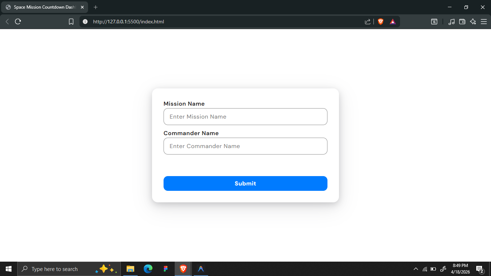
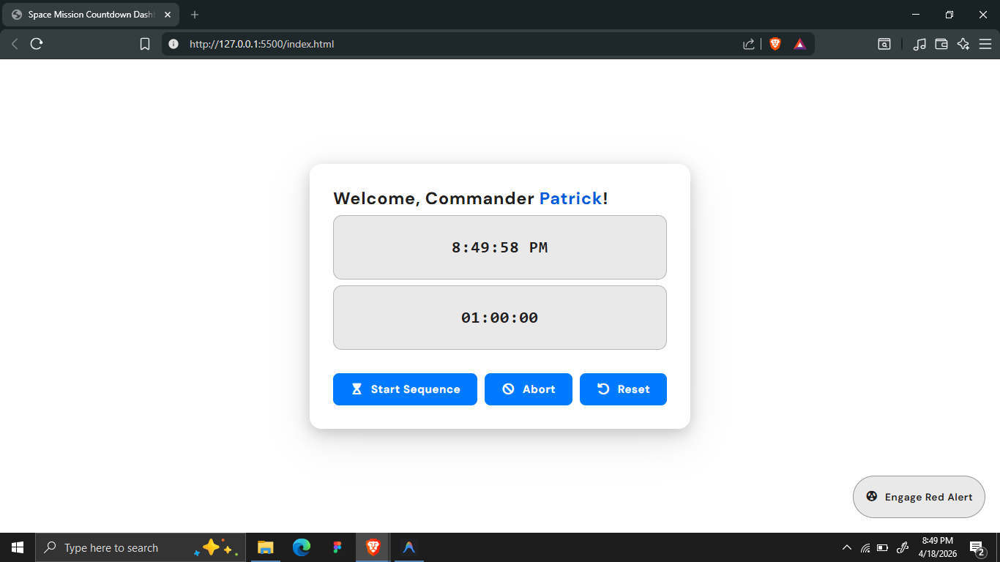
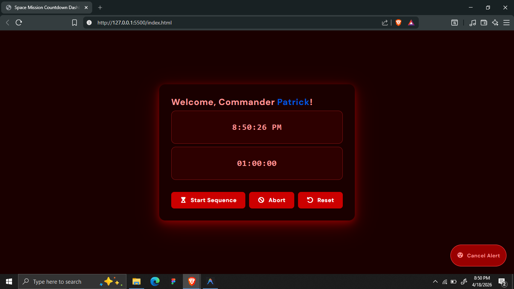

# Space Mission Countdown Dashboard

A web-based interactive dashboard that simulates a space mission launch sequence. Users authenticate as a Commander through a pre-launch validation gate, then gain access to a live mission control panel featuring a real-time clock, a high-precision countdown timer, and an immersive Red Alert mode.

## Screenshots

  
  &nbsp;
  
  

## Features

- **Mission Validation Form:** A pre-launch access screen that validates both the Mission Name and Commander Name before granting access to the dashboard. Empty fields trigger a red inline error message.
- **Main Launch Dashboard:**
  - **Commander Welcome:** Dynamically injects the Commander's name from the form into the dashboard heading upon successful validation.
  - **Live Clock:** Displays the current real-time system time, updated every second using `setInterval`.
  - **Launch Countdown Timer:** A high-precision countdown timer (MM:SS:ms) that ticks every 10ms using timestamp-delta tracking for accuracy.
  - **Launch Controls:**
    - **Start Sequence:** Begins the countdown from the current time remaining.
    - **Abort:** Stops the countdown and displays a `MISSION ABORTED` warning in red.
    - **Reset:** Stops the countdown and resets the display back to `02:00:00`.
  - On reaching zero, the timer automatically stops and displays `LIFTOFF!` in green.
- **Red Alert Mode:** A fixed floating button (`Engage Red Alert / Cancel Alert`) toggles a body-level CSS class that switches the entire color scheme to a deep red palette, simulating a mission emergency.

## How to Run

1. Clone or download this repository.
2. Open `index.html` in any modern web browser — no build step or server required.
3. Enter a **Mission Name** and **Commander Name** to pass the pre-launch validation.
4. Use the **Start Sequence**, **Abort**, and **Reset** buttons to control the countdown.
5. Click **Engage Red Alert** (bottom-right) to toggle the emergency color scheme.
